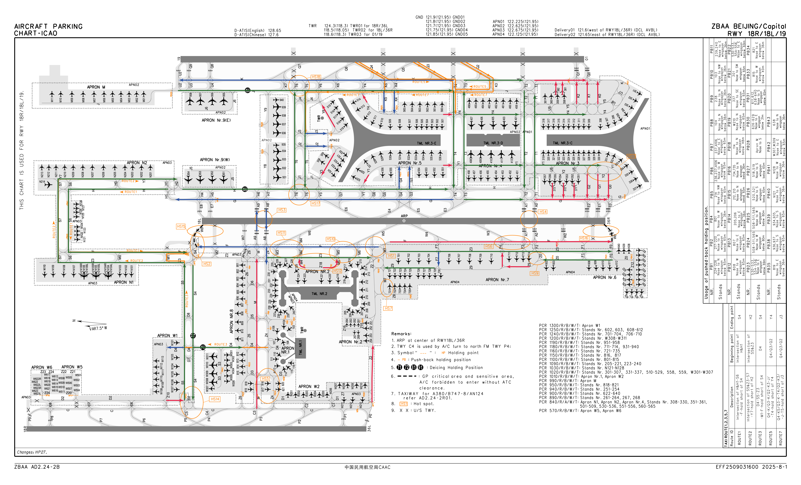

# 北京首都国际机场（ZBAA）标准运行程序

## 1. 总则

### 1.1 根据

为了确保 VATPRC 管辖范围内的北京首都机场（ZBAA）实现安全、合规和高效的运行，依据中国民用航空局（CAAC）发布的[《中华人民共和国航空资料汇编》](https://www.eaipchina.cn)，结合 VATPRC 的实际运行情况，制定了适用于北京首都机场（ZBAA）的标准运行程序。

### 1.2 原则

管制员上线时需遵守 [VATSIM Code of Conduct (COC)](https://vatsim.net/docs/policy/code-of-conduct) ，并积极与上下级管制员协调以达成一致认知。

### 1.3 适用范围

本文件的使用范围是 VATPRC 管辖内北京首都机场的塔台、地面、放行、机坪席位。

> [!CAUTION]
> 本文件严禁用于真实运行!

### 1.4 名词解释及图片备注

本文件中出现的“北绕滑”一词特指：由 Y7、H 滑行道 H2（不含）以北部分，Z3、F 滑行道 S4（不含）以北部分，S6、S7、M0、H0 滑行道和 N2 机坪组成的封闭区域。

本文件中所有的滑行路线图使用的颜色如下：
| 颜色 | 使用场景 |
|:---:|:-----:|
| 红色 | 离场 |
| 绿色 | 离场、进场 |
| 蓝色 | 进场 |

## 2. 运行信息

### 2.1 跑道可用距离

#### 离场跑道可用起飞滑跑距离（TORA）

| 跑道编号 |   等待点编号    | 可用距离（米） |
| :------: | :-------------: | :------------: |
|   36L    |  全跑道（P0）   |      3200      |
|   36L    |       P1        |      2980      |
|   36R    | 全跑道（E0/W0） |      3800      |
|   36R    |       E1        |      3725      |
|   36R    |       E2        |      3625      |
|   36R    |       W1        |      3680      |
|   36R    |       W2        |      3420      |
|    01    |  全跑道（Q0）   |      3800      |
|    01    |       Q1        |      3725      |
|   18R    |  全跑道（P9）   |      3200      |
|   18R    |       P8        |      2980      |
|   18L    | 全跑道（W9/E8） |      3800      |
|   18L    |       W8        |      3680      |
|   18L    |       W7        |      3420      |
|   18L    |       E7        |      3725      |
|    19    |  全跑道（U2）   |      3800      |
|    19    |       Q9        |      3725      |
|    19    |       Q8        |      3525      |

#### 所有跑道的跑道长度

| 跑道编号 | 可用距离（米） |
| :------: | :------------: |
| 36L/18R  |      3200      |
| 36R/18L  |      3800      |
|  01/19   |      3800      |

### 2.2 跑道穿越联络道

#### 2.2.1 北向运行时跑道穿越联络道使用规则

> [!NOTE]
> 默认使用北绕滑，ZBAA_TWR可决定是否启用跑道穿越

- 跑道：36R
  - A9 向东穿越
  - A8 向西穿越
    > [!WARNING]
    > A0、A1 正常运行时不提供使用
    > 无法使用自身动力滑行的航空器应使用北绕滑，不得穿越跑道

#### 2.2.2 南向运行时跑道穿越联络道

- 跑道：18L
  - A1 向西穿越
  - A0 向东穿越
    > [!WARNING]
    > A8、A9 正常运行时不提供使用
    >
    > 无法使用自身动力滑行的航空器应使用北绕滑，不得穿越跑道

### 2.3 机场运行标准跑道组合

#### 2.3.1 日常情况运行

| 运行模式 |   起飞跑道   |   落地跑道   | 备注                                                                            |
| -------- | :----------: | :----------: | ------------------------------------------------------------------------------- |
| 北向运行 | 36L, 36R, 01 | 36L, 36R, 01 | 任意两条平行跑道可以实施相关平行仪表进近，跑道 36L、01 可以实施独立平行仪表进近 |
| 南向运行 | 18R, 18L, 19 | 18R, 18L, 19 | 任意两条平行跑道可以实施相关平行仪表进近                                        |

#### 2.3.2 低能见度运行

> [!IMPORTANT]
> 适用条件：跑道视程 RVR 小于 550m，或云高小于 60m 时
>
> 北京首都机场低能见度运行仅适用于北向运行

| 跑道 | RVR550-400 | RVR400-300 | RVR300-175 | RVR175-150 | RVR150-90 |
| :--: | :--------: | :--------: | :--------: | :--------: | :-------: |
| 36L  |    起飞    |    关闭    |    关闭    |    关闭    |   关闭    |
| 36R  | 起飞、降落 | 起飞、降落 | 起飞、降落 |    起飞    |   关闭    |
|  01  | 起飞、降落 | 起飞、降落 |    起飞    |    起飞    |   起飞    |

#### 2.3.3 宵禁时段运行限制

> [!IMPORTANT]
> 可视情况取消

适用时段：2330CST-0530CST（1530UTC-2130UTC）
01/19 号跑道实施限制运行，01 号跑道不允许航空器降落，19 号跑道不允许航空器起飞

## 3. 席位划分

### 3.1 塔台

#### 登录信息

|   登录名   |          呼号          |  频率   |                               职责范围                               |
| :--------: | :--------------------: | :-----: | :------------------------------------------------------------------: |
|  ZBAA_TWR  | 北京塔台/Beijing Tower | 118.500 | 所有跑道及联络道、C 滑行道、F 滑行道 M7 以南部分及 W7 与 S4 之间部分 |
| ZBAA_W_TWR | 北京塔台/Beijing Tower | 124.300 |                  36L/18R 跑道及配套联络道、C 滑行道                  |
| ZBAA_E_TWR | 北京塔台/Beijing Tower | 118.600 |                        01/19 跑道及配套联络道                        |

#### 塔台管制空域

> 需要!!!!图 3.1.0 塔台管制区示意图!!!!
> （**补个图**）

#### 席位开设规则

1. 北向运行时，F 滑行道 W7 与 S4 之间部分由 ZBAA_W_RMP 代管
2. 经 ZBAA_TWR 同意后可开设 ZBAA_E_TWR，ZBAA_E_TWR开设后 ZBAA_TWR 管辖范围为 36R/18L 跑道及配套联络道，ZBAA_E_TWR 管辖范围为 01/19 跑道和 36L/18R 跑道及配套联络道
3. ZBAA_TWR 及 ZBAA_E_TWR 均在线时，经 ZBAA_TWR 及 ZBAA_E_TWR 同意后方可开设 ZBAA_W_TWR

#### 各塔台管制范围

- ZBAA_TWR（合扇）：所有跑道及联络道、C 滑行道、D9 滑行道、F 滑行道 M7 以南部分及 W7 与 S4 之间部分
- ZBAA_W_TWR：36L/18R 跑道及配套联络道、C 滑行道（粉色）
- ZBAA_TWR（分扇）：36R/18L 跑道及配套联络道、D9 滑行道、F 滑行道 M7 以南部分及 W7 与 S4 之间部分（蓝色）
- ZBAA_E_TWR：01/19 跑道及配套联络道（绿色）

> [!IMPORTANT]
> 橙色代管区域在北向运行时由 ZBAA_W_RMP 提供管制服务，南向运行时由 ZBAA_TWR 提供管制服务

图 3.1.1塔台管制范围划分图（橙色部分为 ZBAA_W_RMP 代管区域）

### 3.2 地面

#### 登录信息

|  登录名  |          呼号           |  频率   |         职责范围          |
| :------: | :---------------------: | :-----: | :-----------------------: |
| ZBAA_GND | 北京地面/Beijing Ground | 121.800 | 全机场地面管制区及9号机坪 |

#### 席位开设规则

1. 机坪管制席位不在线时，ZBAA_GND 需代管机坪管制范围

### 3.3 放行

#### 登录信息

|   登录名   |           呼号            |  频率   |          职责范围          |
| :--------: | :-----------------------: | :-----: | :------------------------: |
|  ZBAA_DEL  | 北京放行/Beijing Delivery | 121.600 |           全机场           |
| ZBAA_E_DEL | 北京放行/Beijing Delivery | 121.650 | 36R/18L 跑道中线延长线以东 |

#### 席位开设规则

1. 经 ZBAA_DEL 同意后可开设 ZBAA_E_DEL，开设后 ZBAA_DEL 管制范围为 36R/18L 跑道中线延长线以西

### 3.4 机坪

#### 登录信息

|   登录名   |          呼号          |  频率   |             职责范围              |
| :--------: | :--------------------: | :-----: | :-------------------------------: |
|  ZBAA_RMP  | 北京机坪/Beijing Apron | 122.225 | 全机场机坪管制区域（不含9号机坪） |
| ZBAA_W_RMP | 北京机坪/Beijing Apron | 122.675 |         APN03+04 管制区域         |

#### 席位开设规则

1. 北京首都机场有塔台或地面管制席位在线时，可开设 ZBAA_RMP
2. ZBAA_RMP 在线时，经 ZBAA_RMP 同意，可开设 ZBAA_W_RMP

#### 各机坪管制范围

- ZBAA_RMP（合扇）：全机场机坪管制区域
- ZBAA_RMP（分扇）：APN01+02 管制区域（不含9号机坪）（蓝色）
- ZBAA_W_RMP：APN03+04 管制区域（红色）

> [!IMPORTANT]
> 橙色代管区域在北向运行时由 ZBAA_W_RMP 提供管制服务，南向运行时由 ZBAA_TWR 提供管制服务

图 3.2 机坪划分图（橙色部分为 ZBAA_W_RMP 代管区域）

## 4. 席位职责

### 4.1 塔台

#### 离场航空器的放飞规则和移交

离场航空器放飞需要满足下列条件：

1. 单一跑道满足其尾流间隔
2. 对于不同跑道同一离场点机组采取最少 2 分钟（120 秒）的间隔
3. 北京首都机场具有实施缩小航空器起飞着陆间隔的能力，在满足下列条件时可以实施缩小航空器起飞着陆间隔：
   - **前行航空器与后随航空器使用不同离场程序**
   - 时间在日出 30 分钟后，日落 30 分钟前
   - 能见度大于 5000 米，云底高大于 300 米
   - 跑道顺风分量小于 2.5m/s
   - 满足尾流间隔
   - 航空器离场后能保持与前序航空器的间隔
   - 跑道情况不影响刹车效应
     > [!NOTE]
     > 实施缩小航空器起飞着陆间隔时，前行起飞航空器离地并距离后随航空器 2400 米以上时，可以许可后随起飞航空器起飞
4. 对于同一跑道航空器复飞后，在复飞航空器通过跑道头后 2 分钟(120 秒)后放飞。满足缩小航空器起飞着陆间隔时，在复飞航空器距起飞航空器 2400 米以上时，可以许可航空器起飞
5. 对于同一跑道航空器执行起落航线时，在起落航线上的航空器加入三边后放飞离场航空器
6. 需要雷达引导的航空器，塔台管制员在许可航空器进入跑道前必须向当前正在对终端管制区提供管制服务的管制席位通报雷达引导需求

#### 进场航空器的处理

> [!IMPORTANT]
> 对于使用跑道 36R/18L 降落的航空器，**需指示脱离方向**。

#### 复飞航空器的处理

- 仪表进近航空器根据标准复飞程序执行，在航空器有正上升趋势后移交给进近。
- 目视飞行规则航空器复飞后加入本场起落航线。

#### 目视飞行规则离场航空器的处理

目视飞行规则离场航空器离场时依照其协调内容给予保持一边、加入起落航线等指令，并于 300~450 米间移交给进近。

> [!IMPORTANT]
> 目视飞行规则航空器离场前必须与上级单位协调。

#### 起落航线

|  跑道   | 起落航线方向 |   高度   |                                  宽度                                  |   备注   |
| :-----: | :----------: | :------: | :--------------------------------------------------------------------: | :------: |
|  01/19  | 跑道东侧为主 | 350-500m |                                 无要求                                 | 优先使用 |
| 18R/36L | 跑道西侧为主 | 350-650m | 最大 6km（宽度 4 至 6km 范围内最高 350m，宽度 4km 以内高度 650m 以下） |          |

#### 与其它场面席位的移交

|  管制席位  |  移交对象  |              先决条件              |          移交时机          |
| :--------: | :--------: | :--------------------------------: | :------------------------: |
|  ZBAA_TWR  |  ZBAA_GND  |          36R 跑道向东脱离          |     给出滑行方向后移交     |
|  ZBAA_TWR  |  ZBAA_GND  |        沿 A9 穿越 36R 跑道         |     给出滑行方向后移交     |
|  ZBAA_TWR  | ZBAA_W_RMP |          36R 跑道向西脱离          |     给出滑行方向后移交     |
|  ZBAA_TWR  | ZBAA_W_RMP |        沿 A8 穿越 36R 跑道         |     给出滑行方向后移交     |
|  ZBAA_TWR  | ZBAA_W_RMP |          18L 跑道向西脱离          |          Z3/M7 前          |
|  ZBAA_TWR  | ZBAA_W_RMP |          A1 穿越 18L 跑道          |          Z3/M7 前          |
|  ZBAA_TWR  |  ZBAA_RMP  |      18L 跑道沿 E0/E1/E2 脱离      |       脱离后立即移交       |
|  ZBAA_TWR  |  ZBAA_GND  | 18L 跑道向东（除 E0/E1/E2 外）脱离 |     给出滑行方向后移交     |
|  ZBAA_TWR  |  ZBAA_RMP  |  A0 穿越 18L 跑道后右转沿 G 滑行   |           E2 前            |
|  ZBAA_TWR  |  ZBAA_GND  |    A0 穿越 18L 跑道（不向右转）    |            G 前            |
| ZBAA_E_TWR |  ZBAA_GND  |            01 跑道脱离             |     给出滑行方向后移交     |
| ZBAA_E_TWR |  ZBAA_GND  |        19 跑道沿 Q3/Q4 脱离        |            K 前            |
| ZBAA_E_TWR |  ZBAA_GND  |         19 跑道沿 Q2 脱离          |     给出滑行方向后移交     |
| ZBAA_E_TWR |  ZBAA_RMP  |        19 跑道沿 Q0/Q1 脱离        |            K 前            |
| ZBAA_W_TWR | ZBAA_W_RMP |             沿 C 滑行              | 在预计向东转向的道口前移交 |

> [!NOTE]
>
> 1. 根据其目的地方向联系 ZBAA_GND 或 ZBAA_RMP（如无明确方向，默认联系 ZBAA_GND），或右转沿 G 在 E2 前等，联系 ZBAA_RMP

#### 与对终端区提供雷达管制服务的席位的移交优先级

| 优先级 |    席位    |  频率   |
| :----: | :--------: | :-----: |
|   1    | ZBAA_F_APP | 126.100 |
|   2    |  ZBAA_APP  | 120.600 |
|   3    | ZBAA_C_CTR | 126.950 |
|   4    |  ZBAA_CTR  | 126.700 |
|   5    |  ZBPE_CTR  | 125.900 |

### 4.2 地面席位

#### 滑行道的使用

##### 北向运行

图 4.1 北向滑行图（红线表离场、蓝线表进场、绿线表进离场皆可、箭头代表运行方向）

##### 南向运行

图 4.2 南向滑行图（红线表离场、蓝线表进场、绿线表进离场皆可、箭头代表运行方向）

#### 与其他场面席位的移交

##### 与塔台的移交

| 运行方向 |  移交对象  |        移交位置         |
| :------: | :--------: | :---------------------: |
|   北向   | ZBAA_E_TWR |         K Q1 前         |
|   北向   |  ZBAA_TWR  |         G E2 前         |
|   北向   |  ZBAA_TWR  |         G A8 前         |
|   南向   | ZBAA_E_TWR |         K Q8 前         |
|   南向   | ZBAA_E_TWR | J（M 维修坪向南） H2 前 |
|   南向   |  ZBAA_TWR  |         G E7 前         |
|   南向   |  ZBAA_TWR  |  H（北绕滑向南） H4 前  |

##### 与机坪的移交

| 运行方向  |  移交对象  |    移交位置    |
| :-------: | :--------: | :------------: |
| 北向/南向 | ZBAA_W_RMP |    G H1 前     |
| 北向/南向 |  ZBAA_RMP  |    T1 Y2 前    |
| 北向/南向 |  ZBAA_RMP  |    T2 Y5 前    |
| 北向/南向 |  ZBAA_RMP  | T3/G4/G5 Y1 前 |
| 北向/南向 |  ZBAA_RMP  | T4/K4/K5 Y4 前 |
| 北向/南向 |  ZBAA_RMP  |    J2 Y3 前    |
| 北向/南向 |  ZBAA_RMP  |    J3 Y6 前    |
| 北向/南向 |  ZBAA_RMP  |   H/H7 Y8 前   |
| 北向/南向 |  ZBAA_RMP  |   J Y9/U2 前   |
|   南向    |  ZBAA_RMP  |    G G2 前     |
|   南向    |  ZBAA_RMP  |    K K2 前     |

#### 9号机坪管制规则

1. 原则上不向到达航空器发布 9 号机坪的机位，需要进入 9 号机坪的航空器由 ZBAA_GND 指挥
2. 航空器进入 9 号机坪进行除冰作业，由 ZBAA_GND 指挥
3. 在 9 号机坪停放需滑出的航空器，开车由 ZBAA_RMP 指挥，滑行由 ZBAA_GND 指挥（若航空器预计使用 E7/E8 等待点，则直接由ZBAA_RMP向ZBAA_TWR移交）

### 4.3 机坪席位

#### 推出至带有运行方向限制的滑行道

部分机位推出时可能需要推出至带有运行方向限制的滑行道，滑行道方向限制见 4.2 滑行道的使用
相应机位推出位置与朝向应当参照以下规则：
一、优先指定不干扰带限制滑行道运行的推出位置
二、目标滑行道为Z0/Z9/Z3/S6/Y7的：

1. 优先指定和目标滑行道运行方向限制相同的推出方向
2. 需要指定与目标滑行道运行方向限制不同的推出方向时，应指挥航空器就近脱离推出时占用的滑行道
   三、目标滑行道为Z18/J2/J3/Y3/Y6/G3/G4/K4/K5的：
   严格按照滑行道运行方向限制指定朝向

#### 部分机位进出路线

| 停机位                   |   滑入   |  滑出  |
| :----------------------- | :------: | :----: |
| Nr.W617-W621             |   Z24    |  Z23   |
| Nr.W505-W507             |   Z22    |  Z21   |
| Nr.W101.W108-W113        |  D4 Z10  |   D2   |
| Nr.W103-W107（除冰机位） |  D4 Z10  |   S5   |
| Nr.W211-W213（除冰机位） |    Z7    |   C    |
| Nr.223                   |    Z3    | Z18 M4 |
| Nr.224-226               |    M4    | Z18 M4 |
| Nr.217-219               |    M5    | Z18 M5 |
| Nr.220.221               |    Z3    | Z18 M5 |
| Nr.261-264               |   Z16    |   Z1   |
| Nr.251-254               |    Z2    |  Z15   |
| Nr.701-705.711-714       |    Z3    |   Z3   |
| Nr.706-710               |    Z3    |   Z9   |
| Nr.501-514.560-565       | K4/K5/Y4 |   Y4   |
| Nr.525-536.551-556       | G3/G4/Y1 |   Y1   |
| Nr.515-519               |    J3    | Y6/J4  |
| Nr.520-524.558.559       |    J2    | Y3/J1  |
| Nr.371-373（除冰机位）   |    Y2    |   G    |
| Nr.381.382（除冰机位）   |    Y5    |   K    |
| Nr.818.819               |    M     |   Z6   |

#### 与其它场面席位的移交

|  管制席位  | 运行方向  |                        先决条件                        |   移交位置   |  移交对象  |
| :--------: | :-------: | :----------------------------------------------------: | :----------: | :--------: |
|  ZBAA_RMP  | 北向/南向 |                沿 T1/T3/Y4/Y9 向东滑行                 |     J 前     |  ZBAA_GND  |
|  ZBAA_RMP  | 北向/南向 |          沿 T2/T4/Y1/Y8 向西滑行(不穿越跑道)           |     H 前     |  ZBAA_GND  |
|  ZBAA_RMP  | 北向/南向 |                     沿 Y3 向西滑行                     |    J1 前     |  ZBAA_GND  |
|  ZBAA_RMP  | 北向/南向 |                     沿 Y6 向东滑行                     |    J4 前     |  ZBAA_GND  |
|  ZBAA_RMP  | 北向/南向 |                     沿 J 向南滑行                      |    U2 前     |  ZBAA_GND  |
|  ZBAA_RMP  |   北向    |                  沿 G0/G1/G2 向西滑行                  |     G 前     |  ZBAA_TWR  |
|  ZBAA_RMP  |   北向    |                   沿 K1/K2 向东滑行                    |     K 前     | ZBAA_E_TWR |
|  ZBAA_RMP  |   南向    |        沿 T2 向西滑行，预计沿 A1 穿越 18L 跑道         |     H 前     |  ZBAA_TWR  |
| ZBAA_W_RMP | 北向/南向 |           预计进入 C 滑行道（含）以西区域的            |     C 前     | ZBAA_W_TWR |
| ZBAA_W_RMP | 北向/南向 |                沿 Route2 （Y7）向南滑行                |    H2 前     |  ZBAA_GND  |
| ZBAA_W_RMP |   北向    |     不在 F 滑行道上，预计进入 M7 以南的 F 滑行道的     |     F 前     |  ZBAA_TWR  |
| ZBAA_W_RMP |   北向    |                     沿 F 向南滑行                      |    M7 前     |  ZBAA_TWR  |
| ZBAA_W_RMP |   北向    | 沿 M 向东滑行/沿 F 向南滑行，预计沿 A9 穿越 36R 跑道的 |    A9 前     |  ZBAA_TWR  |
| ZBAA_W_RMP |   北向    |           W211-W213 机位的航空器准备好滑行后           |   原地移交   | ZBAA_W_TWR |
| ZBAA_W_RMP |   南向    |            沿 F 向北滑行去往 18L 跑道离场的            |    W7 前     |  ZBAA_TWR  |
| ZBAA_W_RMP |   南向    |         沿 Z3 向南滑行，预计沿 F2 A0 穿越跑道          |    F2 前     |  ZBAA_TWR  |
| ZBAA_W_RMP |   南向    |           沿 Route3/Route1 去往 18L 跑道离场           | HP4（S4 前） |  ZBAA_TWR  |

### 4.4 放行

#### DCL操作

1. 原则上 DCL 一律由 ZBAA_DEL 操作
2. 操作 DCL 的席位需要参照各放行席位管制范围在 PDC 的 NEXT FREQ 中注明航空器需要联系的放行席位的频率

#### 飞行计划的审核与处理

| 离场点  |               目的地/大致方向                |     巡航高度      |                                 备注                                  |
| :-----: | :------------------------------------------: | :---------------: | :-------------------------------------------------------------------: |
|  ELKUR  |                     ZSJN                     |     6300/5700     |               主用离场点 前往中原、华南地区航空器不可用               |
|  ELKUR  |            华东、ZGOW、台北情报区            |     米制单数      |               主用离场点 前往中原、华南地区航空器不可用               |
|  IGMOR  |               ZSQD、ZSYT、ZSWH               |     6900/6300     |                              主用离场点                               |
|  IGMOR  |                  ZSZS、ZSHC                  |     米制单数      |                              主用离场点                               |
|  MUGLO  |                     ZYTL                     |     6900/6300     |                              主用离场点                               |
|  MUGLO  |                  RKSI、RKSS                  |  7500/8100/8900   |                              主用离场点                               |
|  MUGLO  |       日朝韩（除 RKSI、RKSS 外）、北美       | 8900 以上米制单数 |                              主用离场点                               |
| `LULTA` |                                              |                   | 原则上不使用 必须由区域管制席位提出使用，进近管制席位同意后才可以使用 |
|  DOTRA  |                     ZYTX                     |     8100/8900     |                              主用离场点                               |
|  DOTRA  |                     ZYCC                     |     9500/8900     |                              主用离场点                               |
|  DOTRA  |            东北、东西伯利亚、北美            |     米制单数      |                              主用离场点                               |
|  IDKEX  |      ZBMZ、ZBLA、ZLDH、蒙古、欧洲、新疆      |     米制双数      |                              主用离场点                               |
|  BOTPU  |                     ZBHH                     |     6000/6600     |                              主用离场点                               |
|  BOTPU  | 西南、西北、南亚、内蒙古自治区、东南亚、欧洲 |     米制双数      |                              主用离场点                               |
|  RUSDO  |                     ZBYN                     |  6600/7200/7800   |                              主用离场点                               |
|  RUSDO  |        华南、中原、西南、东南亚、ZSCN        |     米制双数      |                              主用离场点                               |
|  OMDEK  |                     ZBSJ                     |       4500        |                             非主用离场点                              |
| `PEGSO` |                                              |                   |                             非主用离场点                              |

> [!IMPORTANT]
> 由北京首都机场出发沿京广大通道南下的航空器，不得由 ELKUR 方向离场后沿 W40 航路南下后沿 W562/W4 航路向西加入 W37/A461 航路，应由 RUSDO 方向离场

#### 离场程序或者离场方式

> [!NOTE]
> 原则上，离场航空器不穿越跑道，北绕滑外的离场航空器不经由北绕滑前往跑道等待点

##### 雷达引导离场

> [!IMPORTANT]
> 以当班进近管制员同意为准，仅供参考

| 跑道 |   航向   |
| :--: | :------: |
| 36L  |   330    |
| 36R  | 跑道航迹 |
|  01  |   030    |
| 18R  |   195    |
| 18L  | 跑道航迹 |
|  19  |   150    |

##### 北向

> [!IMPORTANT]
> 灰色底纹标出离场点为非主用离场点
> 灰色底纹标出跑道为在该离场点非主用跑道，需与进近管制员和对应跑道塔台管制员协调后才能使用

| 离场点  | 跑道  | 主用离场程序 |
| :-----: | :---: | :----------: |
|  ELKUR  | `36L` |   ELKUR-9Z   |
|  ELKUR  |  36R  |   ELKUR-7X   |
|  ELKUR  |  01   |   ELKUR-7X   |
|  IGMOR  | `36L` |   IGMOR-9Z   |
|  IGMOR  |  36R  |   IGMOR-7X   |
|  IGMOR  |  01   |   IGMOR-7X   |
|  MUGLO  | `36L` |   MUGLO-9Z   |
|  MUGLO  |  36R  |   MUGLO-7X   |
|  MUGLO  |  01   |   MUGLO-7X   |
|  DOTRA  | `36L` |   DOTRA-5Y   |
|  DOTRA  |  36R  |   DOTRA-5Y   |
|  DOTRA  |  01   |   DOTRA-7X   |
|  IDKEX  | `36L` |   IDKEX-5Y   |
|  IDKEX  |  36R  |   IDKEX-5Y   |
|  IDKEX  |  01   |   IDKEX-7X   |
|  BOTPU  |  36L  |   BOTPU-9Z   |
|  BOTPU  |  36R  |   BOTPU-7X   |
|  BOTPU  | `01`  |   BOTPU-7X   |
|  RUSDO  |  36L  |   RUSDO-9Z   |
|  RUSDO  |  36R  |   RUSDO-9Z   |
|  RUSDO  | `01`  |   RUSDO-9Z   |
| `PEGSO` |  36L  |   PEGSO-9Z   |
| `PEGSO` |  36R  |   PEGSO-9Z   |
| `PEGSO` | `01`  |   PEGSO-9Z   |
| `OMDEK` |  36L  |   OMDEK-9Z   |
| `OMDEK` |  36R  |   OMDEK-9Z   |
| `OMDEK` | `01`  |   OMDEK-9Z   |

##### 南向

> [!IMPORTANT]
> 灰色底纹标出离场点为非主用离场点
> 灰色底纹标出跑道在该离场点为非主用跑道，需与进近管制员和对应跑道塔台管制员协调后才能使用

| 离场点  | 跑道  | 主用离场程序 |
| :-----: | :---: | :----------: |
|  ELKUR  |  18L  |   ELKUR-2G   |
|  ELKUR  | `18R` |   ELKUR-2G   |
|  ELKUR  | `19`  |   ELKUR-6J   |
|  IGMOR  |  18L  |   IGMOR-2G   |
|  IGMOR  | `18R` |   IGMOR-2G   |
|  IGMOR  |  19   |   IGMOR-6J   |
|  MUGLO  |  18L  |   MUGLO-2G   |
|  MUGLO  | `18R` |   MUGLO-2G   |
|  MUGLO  |  19   |   MUGLO-6J   |
|  DOTRA  |  18L  |   DOTRA-2G   |
|  DOTRA  | `18R` |   DOTRA-2G   |
|  DOTRA  |  19   |   DOTRA-2G   |
|  IDKEX  |  18L  |   IDKEX-2G   |
|  IDKEX  | `18R` |   IDKEX-2G   |
|  IDKEX  |  19   |   IDKEX-2G   |
|  BOTPU  |  18R  |   BOTPU-2G   |
|  BOTPU  |  18L  |   BOTPU-6J   |
|  BOTPU  | `19`  |   BOTPU-4E   |
|  RUSDO  |  18R  |   RUSDO-2G   |
|  RUSDO  |  18L  |   RUSDO-6J   |
|  RUSDO  | `19`  |   RUSDO-4E   |
| `PEGSO` |  18L  |   PEGSO-2G   |
| `PEGSO` |  18R  |   PEGSO-2G   |
| `PEGSO` | `19`  |   PEGSO-2G   |
| `OMDEK` |  18L  |   OMDEK-2G   |
| `OMDEK` |  18R  |   OMDEK-2G   |
| `OMDEK` | `19`  |   OMDEK-2G   |

#### 起始高度

|   跑道   | 36L/18R | 36R/18L | 01/19 |
| :------: | :-----: | :-----: | :---: |
| 起始高度 |  1200m  |  1500m  | 900m  |

#### 放行限制

> [!NOTE]
> 经区域管制席位提出，进近管制席位同意方可启用 LULTA 方向离场，使用程序现场协调

> [!WARNING]
> F 类航空器不可使用 18R/36L 跑道，运行跑道为 18L/36R 跑道、01/19 跑道
>
> 任何航空器禁止以任何形式飞越 ZB(P)801 和禁止绕飞区

## 5. 其它参考资料

### 5.1 A380、B747-8、AN124 本场运行规则

#### 机位

| 机型   | 停机位                                                                                                                                    |
| :----- | :---------------------------------------------------------------------------------------------------------------------------------------- |
| A388   | 507-509、701、702、931、932、938、939、951、955、M01、M02                                                                                 |
| AN124  | 507-509、701、702、931、932、938、939、951、955、 M01、M02、N205、N206                                                                    |
| B747-8 | 308、403、405、410、507-509、530、531、536、701、702、709、710、931、932、938、939、951、955、M01、M02、N104-N106、N109、 N205-N207、N214 |

#### 可运行滑行道

> 需要!!!!图 5.1 A380、B747-8、AN124 可运行滑行道图!!!!

|                                                       受限滑行道                                                       |                                 受限内容                                 |
| :--------------------------------------------------------------------------------------------------------------------: | :----------------------------------------------------------------------: |
|                                                Y1、Y2（T2 与 G1 之间）                                                 | F 类航空器在其中一条滑行道上时，另一滑行道上滑行的航空器翼展不得超过 52m |
|                                                   Y1、Y2（G1 以南）                                                    |         F 类航空器在其中一条滑行道上时，另一滑行道禁止航空器运行         |
| F（W2 以南）、F0、F1、F4（Z3 以西）、F7（Z3 以西）、W0、Z0（F0 与 HP14 之间）、Z3（F2 以南）、Z9（F7 与 714 机位之间） |                             仅允许 B748 运行                             |
|                                                           W2                                                           |                             禁止向南转 F 滑                              |
|                                                           A0                                                           |                            禁止向 G、F 滑转弯                            |
|                                                           A1                                                           |                             禁止向南转 F 滑                              |
|                                                           A1                                                           |                             禁止向 G 滑转弯                              |
|                                                           F4                                                           |                       东向西滑行时禁止向北转 F 滑                        |
|                                                           M4                                                           |                       东向西滑行时禁止向 F 滑转弯                        |
|                                                           S6                                                           |                       东向西滑行时禁止向北转 F 滑                        |
|                                                           S6                                                           |                       西向东滑行时禁止向 F 滑转弯                        |
|                                                           S7                                                           |                       西向东滑行时禁止向 F 滑转弯                        |

### 5.2 低能见度运行

1. 适用条件：跑道视程 RVR 小于 550m，或云高小于 60m 时

2. 可运行区域：跑道 36L/18R 及其联络道除外的所有区域

3. 跑道联络道使用限制：
   - 跑道 36L/18R 的所有跑道联络道不得使用
   - A0、A1 联络道关闭，不得使用
   - 出现航空器误入跑道联络道时，应立刻停止对应跑道的一切起落活动，立即清空跑道并指挥误入航空器离开联络道，然后重新恢复正常低能见度运行

4. 低能见度滑行路线（仅北向）：
   
   图 5.2 北向低能见度滑行图（红线表离场、蓝线表进场、绿线表进离场皆可、箭头代表运行方向）

5. 塔台席位与其他场面席位的移交

| 下级移交单位 |                 进/出点                  |  移交时机   | 备注 |
| :----------: | :--------------------------------------: | :---------: | :--: |
|   ZBAA_GND   | 向东脱离 36R 跑道或沿 A9 穿越 36R 跑道后 |  G 前移交   |  /   |
|  ZBAA_W_RMP  | 向西脱离 36R 跑道或沿 A8 穿越 36R 跑道后 | F/D9 前移交 |  /   |
|   ZBAA_GND   |              脱离 01 跑道后              | 在 K 前移交 |  /   |

6. 地面席位与其他场面席位的移交

| 当前管制单位 | 下级移交单位 |    进/出点    |                             移交时机                             |                   备注                    |     |
| :----------: | :----------: | :-----------: | :--------------------------------------------------------------: | :---------------------------------------: | :-: |
|     地面     |     塔台     |       /       | G E7 前、H（北绕滑向南） H4 前、K Q8 前、J（M 维修坪向南） H2 前 |                     /                     |     |
|     地面     |     塔台     | 穿越 36R 跑道 |                            A8 外等 后                            | 航空器被批准使用 A8 联络道穿越 36R 跑道时 |     |
|     地面     |     机坪     |       /       |                                /                                 |          同[4.2](#与机坪的移交)           |  /  |

> [!CAUTION]
> 航空器未联系塔台，不得进入联络道，不得跨越 CATⅡ/Ⅲ 等待点

7. 机坪席位与其他场面席位的移交

同[4.2](#与机坪的移交)

### 5.3 航空器停放位置参考

> [!TIP]
> 此条内容仅为参考，不作为强制要求

1. 远机位均为国内、国际港澳台航班混合停放

2. 二号航站楼

| 类型                         | 机位            |
| :--------------------------- | :-------------- |
| 仅供国内航班停放             | 220.221.226-240 |
| 仅供国际港澳台航班停放       | 205-218         |
| 国内、国际港澳台航班混合停放 | 219             |

以下航空公司在二号航站楼运行：

|                         |                         |                                 |
| :---------------------- | :---------------------- | :------------------------------ |
| 桂林航空（CGH）         | 江西航空（CJX）         | 中国国际航空（CCA）（部分航线） |
| 济州航空（JJA）         | 阿塞拜疆航空（AHY）     | 柬埔寨天空吴哥航空（SWM）       |
| 亚洲航空（长途）（XAX） | 四川航空（CSC）         | 俄罗斯北方之星航空（TYA）       |
| 达美航空（DAL）         | 海南航空（CHH）         | 菲律宾宿务太平洋航空（CEB）     |
| 中国东方航空（CES）     | 大韩航空（KAL）         | 法国航空（AFR）                 |
| 俄罗斯航空（AFL）       | 乌兹别克斯坦航空（UZB） | 荷兰皇家航空（KLM）             |
| 阿斯塔纳航空（KZR）     | 高丽航空（KOR）         | 巴基斯坦航空（PIA）             |
| 印度尼西亚鹰航（GIA）   | 斯里兰卡航空（ALK）     | 土库曼斯坦航空（TUA）           |
| 越南航空（HVN）         | 阿尔及利亚航空（DAH）   | 香港航空（CRK）                 |
| 大新华航空（GDC）       | 祥鹏航空（LKE）         |                                 |

3. 三号航站楼

| 类型                   | 区域     |
| :--------------------- | :------- |
| 仅供国内航班停放       | T3C、T3D |
| 仅供国际港澳台航班停放 | T3E      |

以下航空公司在三号航站楼运行：

|                     |                     |                       |
| :------------------ | :------------------ | :-------------------- |
| 东海航空(EPA)       | 昆明航空(KNA)       | 柬埔寨吴哥航空（KHV） |
| 伊朗马汉航空（IRM） | 浙江长龙航空（CDC） | 青岛航空（QDA）       |
| 西藏航空（TBA）     | 波兰航空（LOT）     | 中国国际航空（CCA）   |
| 瑞士航空（SWR）     | 大连航空（CCD）     | 山东航空（CDG）       |
| 奥地利航空（AUA）   | 北欧航空（AUA）     | 汉莎航空（DLH）       |
| 韩亚航空（AAR）     | 加拿大航空（ACA）   | 美国联合航空（UAL）   |
| 全日本航空（ANA）   | 土耳其航空（THY）   | 埃及航空（MSA）       |
| 泰国国际航空（THA） | 新加坡航空（SIA）   | 芬兰航空（FIN）       |
| 国泰航空（CPA）     | 日本航空（JAL）     | 阿联酋航空（UAE）     |
| 以色列航空（ELY）   | 卡塔尔航空（QTR）   | 长荣航空（EVA）       |
| 澳门航空（AMU）     | 中华航空（CAL）     | 阿提哈德航空（ETD）   |
| 深圳航空（CSZ）     | 蒙古航空（MGL）     | 埃塞俄比亚航空（ETH） |
| 菲律宾航空（PAL）   |                     |                       |

4. 其他航空器

| 航空器类型        | 机位                                                                        |
| :---------------- | :-------------------------------------------------------------------------- |
| 公务机            | W5、W6 机坪所有机位，251-254、261-264、267、268、602、603、608-612、622-640 |
| 货运航空器        | W1、W3、N2、8 号机坪所有机位                                                |
| 维修航空器        | M 维修机坪、7 号机坪所有机位                                                |
| 除冰航空器（36L） | W211-W213                                                                   |
| 除冰航空器（36R） | 706-710. 371-373，G0、G1、G2 滑行道                                         |
| 除冰航空器（01）  | 381. 382，K1、K2 滑行道                                                     |
| 除冰航空器（18R） | W103-W107                                                                   |
| 除冰航空器（18L） | W103-W107. 951-954                                                          |
| 除冰航空器（19）  | 955-958                                                                     |
